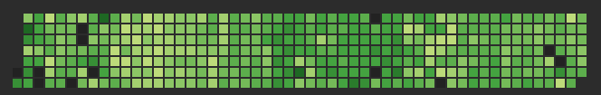
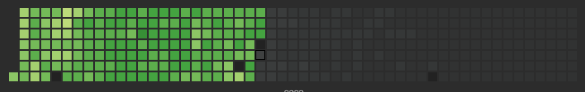

# anki

Analysis of anki review data. Very new and incomplete, see anki_review for some initial analysis on card review data.

Anki is a popular computer-based flashcard application designed to help users with memory retention and learning. It utilizes the concept of spaced repetition, which is a learning technique that optimizes the timing of reviewing information to enhance long-term memory.

## Review heatmaps:

Heatmaps of reviews per day for three years. Daily card average of 175. 

